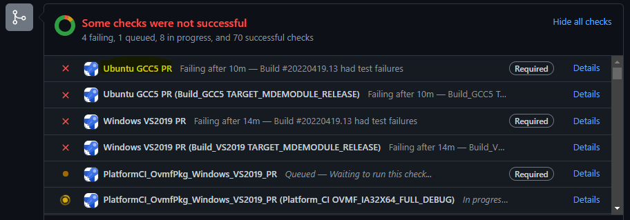
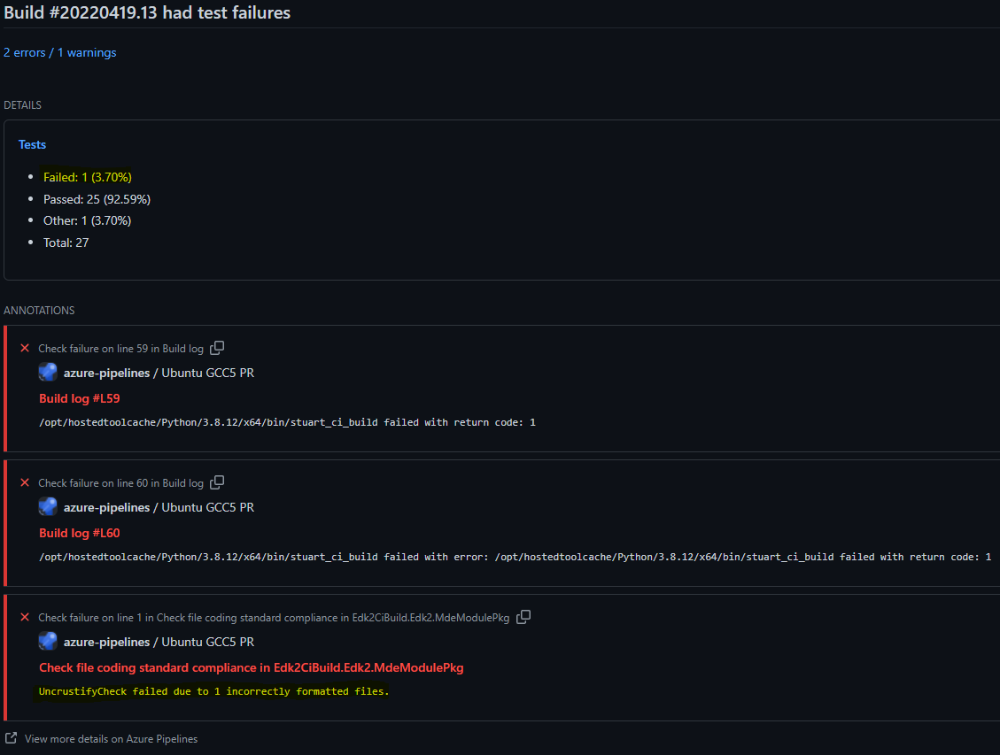
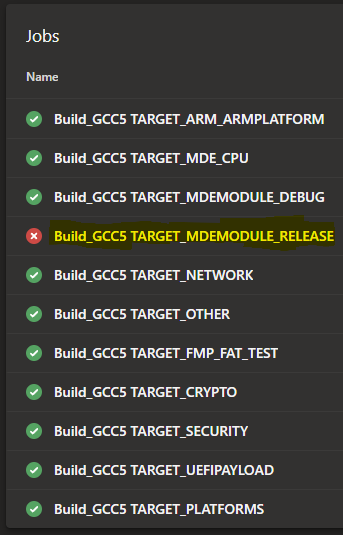
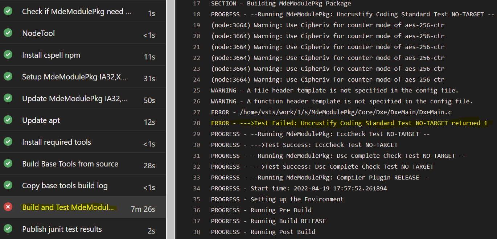
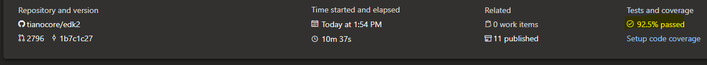
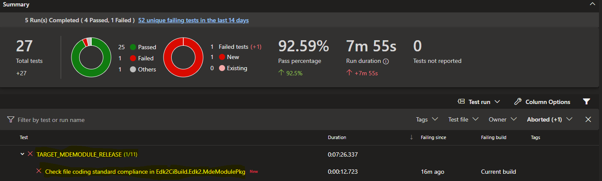
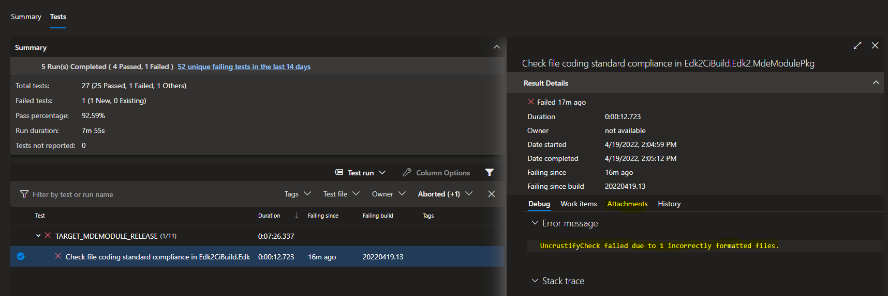
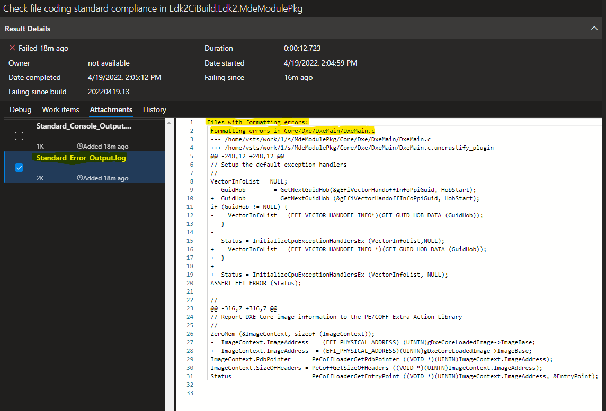

# EDK II Code Formatting

To better realize the goals of the [EDK II C Coding Standards Specification](https://edk2-docs.gitbook.io/edk-ii-c-coding-standards-specification/),
EDK II code formatting is automated using a source code beautifier called Uncrustify. Uncrustify is compatible with
C/C++ in addition to other languages. In EDK II, it is used to format C language source code.

## Uncrustify in the edk2 Repository

The Uncrustify collateral in the edk2 repository contains all of the resources needed to get the Uncrustify application
and run it with the same settings as other developers.

> Uncrustify is automatically run against code submitted in edk2 as a continuous integration (CI) plugin called
"UncrustifyCheck". The plugin is available in the following directory:
[.pytool/Plugin/UncrustifyCheck](https://github.com/tianocore/edk2/tree/master/.pytool/Plugin/UncrustifyCheck)

The UncrustifyCheck plugin in edk2 contains the following files used to check code for compliance to the coding
standard:

* **default_file_header.txt** - A text file containing a template that is placed at the top of files missing a file
  header.
* **default_function_header.txt** - A text file containing a template that is placed above functions that are missing
  a function header.
* [**Readme.md**](https://github.com/tianocore/edk2/blob/master/.pytool/Plugin/UncrustifyCheck/Readme.md) - A file that contains details about how the plugin works and how to use it.
* **uncrustify_ext_dep.yml** - An "external dependency" file that is used to get the current version of the Uncrustify
  application used by the plugin. This file contains the NuGet feed URL and the version currently used.
* **uncrustify_plug_in.yaml** - A file that contains information to describe the plugin to the build environment.
* [**uncrustify.cfg**](https://github.com/tianocore/edk2/blob/master/.pytool/Plugin/UncrustifyCheck/uncrustify.cfg) - A file used by the Uncrustify application to control how it formats code. If you want to tweak
  particular formatting details, this is the place to start.
* **UncrustifyCheck.py** - The actual Python file that is the CI plugin. Like all CI plugins, this plugin can be run
  in local CI and server CI.

## How to Find Uncrustify Formatting Errors in Continuous Integration (CI)

The EDK II project uses Azure Pipelines to check that pull requests meet the compilation and formatting requirements
for new code submissions. If a code formatting error is found, the UncrustifyCheck plugin will indicate the files that
contained errors and, if the option is enabled (it currently is by default), a detailed diff of the formatting changes
required for the code to pass the formatting checks.

This section provides the instructions on how to locate these pieces of information in the Azure Pipelines UI. It
is based on a PR that intentionally introduces a code formatting issue in MdeModulePkg/Core/Dxe/DxeMain/DxeMain.c.

1. Recognize the problem in the GitHub PR

   EDK II pull requests are tracked in the [`"Pull Requests"`](https://github.com/tianocore/edk2/pulls) tab.

   The CI build results are visible in real-time. If any checks fail, the pipeline that contained the failure will be
   associated with a red "x" (as opposed to a green check mark).

   **Example:**

   

   We are going to follow the first pipeline "Ubuntu GCC5 PR" to investigate the problem by clicking `"Details"`.

2. Determine the Failure Reason

   

   On this page, it is shown that 1 failure occurred and that is due to 1 incorrectly formatted file in MdeModulePkg.

   To get more information, we need to go to the pipeline. That is done by clicking `"View more details on Azure
   Pipelines"`.

3. Find the Failing Job in the Pipeline

   We are now presented with a list of jobs that make up the pipeline. At least one should have failed. In the case
   shown below, it is "Build_GCC5 TARGET_MDEMODULE_RELEASE".

   

   To get more information about this job, click it (`Build_GCC5 TARGET_MDEMODULE_RELEASE`).

4. Find the Build Failure Information in the Build Step

   Now a series of steps that make up that build job are shown. At least one should have failed, which led to the job
   failure. In the case below, it is "Build and Test MdeModulePkg".

   

   This confirms the failure occurred from the UncrustifyCheck plugin for one file -
   MdeModulePkg/Core/Dxe/DxeMain/DxeMain.c.

5. Go to the Job's Test Results

   At this point, we could go run Uncrustify locally against the file ([directions on this page](#how-to-run-uncrustify)).

   However, we are going to see exactly what changes led to the formatting issue in the file as reported from the CI
   results.

   Back in the job page, a summary is shown at the top of the page like the following:

   

   To learn more about the test results, click the text. In this case, `92.5% passed`.

6. Go to the Failing Test Results

   We can see the test that failed is the "coding standard compliance" test in MdeModulePkg. We expected that based on
   the earlier information we found.

   To learn more about this failure, click the test. In this case,
   `Check file coding standard compliance in Edk2CiBuild.Edk2.MdeModulePkg`.

   

7. Go to the Test Attachments

   We can again see this failure is regarding 1 file in MdeModulePkg. Click `Attachments` to get the error log which
   has the detailed information.

   

8. Go to the Error Log  Attachment

   Now, click the error log to get the error output. In this case, click `Standard_Error_Output.log`.

   

   This log shows the exact changes that are needed to pass code formatting.

   If the changes are not visible, verify whitespace requirements such as line endings being CRLF are present in the
   files, especially in newly added files.

## EDK II Uncrustify Fork

Due to nuances in the way EDK II formats code, some changes were made to the upstream Uncrustify application. These
were changes that could not be controlled purely through the Uncrustify configuration file. For more details about the fork,
please visit that project overview in the link below.

* Uncrustify upstream repository: https://github.com/uncrustify/uncrustify
* Uncrustify EDK II fork repository (in Project Mu): https://dev.azure.com/projectmu/Uncrustify

## Developer Workflow

Developers must install Uncrustify and run the application against their code before sending patch review emails or
submitting pull requests. Pull requests run against EDK II CI which includes the UncrustifyCheck CI plugin.

Fortunately, Uncrustify can be installed quickly, you can format your code quickly locally, and you can verify the
code against the UncrustifyCheck CI plugin before sending it to others.

The recommended flow is:

1. Clone the edk2 source code repository
2. Use the `stuart*` commands to pull the Uncrustify application into the edk2 workspace
3. Set up the ability to run Uncrustify locally (for example, using the Visual Studio Code Uncrustify plugin)
4. Make and test code changes
5. Format code locally using Uncrustify (for example, using the Visual Studio Code Uncrustify plugin)
6. Run EDK II CI locally to verify UncrustifyCheck passes
7. Send the code patch to the EDK II mailing list

## Installing Uncrustify

Uncrustify is a portable executable that is built in the [EDK II Uncrustify fork repository](https://dev.azure.com/projectmu/Uncrustify)
and ultimately published into a NuGet feed in that fork project.

### Recommended Installation: In edk2 repository

It is strongly recommended to follow this flow. It sets up the workspace to work with local CI and automatically gets
the current supported version of the application.

The Uncrustify tool is installed automatically when the pytools environment is used and the `stuart*` commands are run
to complete environment setup. Review the edk2 [.pytool/Readme.md](https://github.com/tianocore/edk2/tree/master/.pytool#running-ci-locally)
file for details on `stuart` and this overall flow.

After running the `stuart_update` command, the Uncrustify application content should be brought down into
`.pytool\Plugin\UncrustifyCheck\mu-uncrustify-release_extdep` in your edk2 workspace. The contents of this directory
now represent the contents of the NuGet package and it should contain a Linux and Windows executable of the
application.

### Manual Installation: Download from the fork project

The [release pipeline](https://dev.azure.com/projectmu/Uncrustify/_build?definitionId=89) in the EDK II Uncrustify fork
project contains the build information for each release. Each build in this pipeline represents a release. By going to
a specific build, the details mapping the build to source code (such as the branch and commit) are present.

The build content is published as a NuGet package to a NuGet feed. This is the same feed, the recommended installation
instructions automatically pull from. The NuGet feed is available in the ["Artifacts"](https://dev.azure.com/projectmu/Uncrustify/_packaging?_a=feed&feed=mu_uncrustify)
section of the fork project. If you hover/click on a specific package entry (e.g. "mu-uncrustify-release"), a set of
three ellipsis will appear. Click the ellipsis and a context menu will appear. The NuGet package can be downloaded
by clicking "Download \<x.y.z\>".

Once downloaded, the `.nupkg` file can be treated as a zip file. If the file is opened as a zip file, the executable
can be found in the `mu-uncrustify-<debug/release>` directory.

## How to Run Uncrustify

Once Uncrustify is installed, you can run the application in a number of ways. In all cases, you should be using the
Uncrustify application built from the [Uncrustify EDK II fork](https://dev.azure.com/projectmu/Uncrustify) and the
[Uncrustify configuration file](https://github.com/tianocore/edk2/blob/master/.pytool/Plugin/UncrustifyCheck/uncrustify.cfg)
currently checked into edk2.

### Recommended Usage: Visual Studio (VS) Code Plugin

The Visual Studio Code plugin provides a way to seamlessly run Uncrustify against code at anytime in the editor and
the configuration details are set once in the editor configuration file.

1. Install the Uncrustify VS Code extension:
   > Name: Uncrustify
     Id: zachflower.uncrustify
     Description: Code format using uncrustify
     Publisher: Zachary Flower
     VS Marketplace Link: <https://marketplace.visualstudio.com/items?itemName=zachflower.uncrustify>

2. Configure the Uncrustify plugin for your local setup by adding the following to your VS Code settings.json file:
   (Windows example)

   ```json
   "uncrustify.configPath.windows": "path_to_your_config_file",
   "uncrustify.executablePath.windows": "path_to_your_uncrustify_executable"
   ```

   > Windows Example:
   >
   >```json
   >"uncrustify.configPath.windows": "D:/src/edk2/.pytool/Plugin/UncrustifyCheck/uncrustify.cfg",
   >"uncrustify.executablePath.windows": "D:/src/edk2/.pytool/Plugin/UncrustifyCheck/mu-uncrustify-release_extdep/Windows-x86/uncrustify.exe"
   >```

3. Open a C source code file, _`Ctrl+Shift+P` -> Format Document With... -> Configure Default Formatter -> Uncrustify_

4. Then, _`Ctrl+Shift+P` -> Format Document_ any time you would like to format your source code file with Uncrustify

### Manual Usage: Run in a Terminal

These instructions are written for Windows 10. These activities could be further automated into a high-level script
but that has not been done yet.

#### Manual Usage - Generate File List

Uncrustify must be given a list of files to run against. This can be done by redirecting the list to stdin or by
providing a text file. Examples of how perform both approaches are given below.

##### Manual Usage - Generate File List via stdin

This is the recommended way to manually run Uncrustify. It is works across Linux and Windows and reduces the number of
overall steps.

Example to run against all .c and .h files in `DynamicTablesPkg` executed from the root of the edk2 workspace.

Linux:

```shell
git ls-files DynamicTablesPkg*.c DynamicTablesPkg*.h | ./.pytool/Plugin/UncrustifyCheck/mu-uncrustify-release_extdep/Linux-x86/uncrustify -c ./.pytool/Plugin/UncrustifyCheck/uncrustify.cfg -F - --replace --no-backup --if-changed
```

Windows:

```shell
git ls-files DynamicTablesPkg*.c DynamicTablesPkg*.h | .\.pytool\Plugin\UncrustifyCheck\mu-uncrustify-release_extdep\Windows-x86\uncrustify.exe -c .\.pytool\Plugin\UncrustifyCheck\uncrustify.cfg -F - --replace --no-backup --if-changed
```

* The `git ls-files` command is used to gather the list of .c and .h files in `DynamicTablesPkg`
* The output from `git ls-files` is redirected to `uncrustify`
* The following options are given to the Uncrustify application:
  * `-c`: The path to the Uncrustify configuration file
  * `-F`: Read the files one per line. `-` indicates the list should be read from stdin.
  * `--replace`: Replace the source files in place (convenient to diff formatting with git)
  * `--no-backup`: Replace files with no backup (again, useful to diff formatting with git)
  * `--if-changed`: Only produce output if a change is detected.

##### Manual Usage - Generate File List via Text File

1. Generate a list of the files to run against. This example generates a recursive list of all .c and .h files.

   * It is recommended to run this in cleanly cloned edk2 repo without submodules to prevent submodule files
     (such as Brotli files in MdeModulePkg) from getting included in the file list (if you are running against all
     files). Including all files will significantly increase the amount of time Uncrustify takes to run.

   * Sample Powershell command to recursively write all .c and .h files in a given package to a text file (this can of course be done with other languages/commands):

     ```powershell
     Get-ChildItem -Path .\MdePkg\* -Include *.c, *.h -Recurse -Force | %{$_.fullname} | Out-File
     -FilePath .\MdePkgFiles.txt -Encoding utf8
     ```

   > **WARNING** Powershell will put the UTF-8 BOM at the beginning of the output file. Uncrustify does not recognize the BOM
   and it should be removed before passing the file as input to Uncrustify. If it is not removed, Uncrustify will
   not read the first file path in the text file properly which will cause the file to not be formatted. **Keep this in mind regardless of the method used for generating the text file.**

2. Run Uncrustify using the generated text file as input

Example to run against all .c and .h files in `MdePkg` executed from the root of the edk2 workspace.

   Windows:

   ```shell
   .\.pytool\Plugin\UncrustifyCheck\mu-uncrustify-release_extdep\Windows-x86\uncrustify.exe -c .\.pytool\Plugin\UncrustifyCheck\uncrustify.cfg -F MdePkgFiles.txt --replace --no-backup --if-changed
   ```

* The following options are given to the Uncrustify application:
  * `-c`: The path to the Uncrustify configuration file
  * `-F`: Read the files one per line from the file `MdePkgFiles.txt`
  * `--replace`: Replace the source files in place (convenient to diff formatting with git)
  * `--no-backup`: Replace files with no backup (again, useful to diff formatting with git)
  * `--if-changed`: Only produce output if a change is detected.

   > *Note:* When testing a configuration change, it is sometimes useful to run Uncrustify against a particular file
     and check the debug output to understand what rule was applied and why it was applied. The command shows an
     example of how to run the configuration file `uncrustify.cfg` against the source file `VariableSmm.c` where the
     file is forced to be treated as C, the debug output is written to `uncrustify_debug.txt` and the log severity level
     is set to "all".

   Windows:

   ```shell
   .\.pytool\Plugin\UncrustifyCheck\mu-uncrustify-release_extdep\Windows-x86\uncrustify.exe -c .\.pytool\Plugin\UncrustifyCheck\uncrustify.cfg -f .\MdeModulePkg\Universal\Variable\RuntimeDxe\VariableSmm.c -o output.c -l C -p uncrustify_debug.txt -L A 2>verbose_debug.txt
   ```

Uncrustify will update the source files in-place (with the commands given). This allows you to diff the results with
git. From here, you can iteratively tweak the configuration file and check the results until you are satisfied with the
outcome.

## Uncrustify in CI

The UncrustifyCheck CI plugin that will verify formatting on the server can be run locally. It is recommended to run
local CI to verify the patch submission will pass CI on the server.

This can be done using the `stuart_ci_build` command.

> Tip: To quickly only run UncrustifyCheck, remove the other plugin directories from your local `.pytool` directory
  and, of course, add them back when you're done.

Here's an example of running UncrustifyCheck against MdeModulePkg from the root of an edk2 workspace:

`stuart_ci_build -c .pytool/CISettings.py -p MdeModulePkg`

If a file has a formatting error, it will be noted in the output from `stuart_ci_build`. This is visible in the
terminal output in local CI and the build output log in server CI.

Read the [UncrustifyCheck Readme.md](https://github.com/tianocore/edk2/blob/master/.pytool/Plugin/UncrustifyCheck/Readme.md)
to understand more about how the plugin can be configured for CI.

## Extra Reading: Tracing History Across the Uncrustify Transition in edk

Note: Most users do not need to read this section.

It might be helpful to view the entire history rewritten with Uncrustify formatting on every commit. For example, an
alternate version of the edk2 repository that serves as "documentation" with the entire history re-written.

A tool called git-filter-repo can be used to perform this transformation and runs in a reasonable period of time
(a few hours):

* <https://github.com/newren/git-filter-repo>
* <https://github.com/newren/git-filter-repo/blob/main/contrib/filter-repo-demos/lint-history>

The following steps can be used to perform this transformation. This is the Windows process. A Linux process will be
added in the future.

  > **WARNING**  This operation modifies (rewrites) all the commits in the local copy of the repo. Do not perform
                 these steps on a local repo you are using for active development.

1. Clone edk2 into a new directory (see **WARNING**)

   ```shell
   git clone https://github.com/tianocore/edk2.git edk2-uncrustified
   cd edk2-uncrustified
   ```

2. Setup python virtual env, install pytools, and run stuart commands to setup build environment which includes
   installing uncrustify tools. See [Running CI Locally](https://github.com/tianocore/edk2/tree/master/.pytool#running-ci-locally).

3. Make a backup copy of the plugin UncrustifyCheck outside WORKSPACE. (e.g. C:\Temp\UncrustifyCheck) so the
   Uncrustify executable and EDK II specific Uncrustify configuration file are available when working with a branch
   that does not have those tools in its scope.

   ```shell
   xcopy .pytool\Plugin\UncrustifyCheck C:\Temp\UncrustifyCheck
   ```

4. Use lint-history.py from git-filter-repo examples

   * [git-filter-repo](https://github.com/newren/git-filter-repo)
   * [lint-history](https://github.com/newren/git-filter-repo/blob/main/contrib/filter-repo-demos/lint-history)

Line #127 - Add try except around subprocess.check_call() with except being pass. This is required because there are a
few commits of C files in the edk2 repo that have incorrect C syntax and do not build with a C compiler and break the
Uncrustify parser. Skip reformat of C files that can not be parsed by uncrustify. These rare instances are addressed in
the commit that fixes the C syntax error.

Run this slightly modified version of lint-history. Include only .c/.h files and exclude directories that start with
`Tools` or `BaseTools`. This step took about 2.2 hours on a laptop.

```shell
lint-history.py
    --relevant "return (not filename.startswith(b'Tools') and not filename.startswith(b'BaseTools') and (filename.endswith(b'.c') or filename.endswith(b'.h')))"
    c:\\work\\GitHub\\tianocore\\foo\\UncrustifyCheck\\mu-uncrustify-release_extdep\\Windows-x86\\uncrustify.exe -c c:\\work\\GitHub\\tianocore\\foo\\UncrustifyCheck\\uncrustify.cfg --replace --no-backup --if-changed
```
