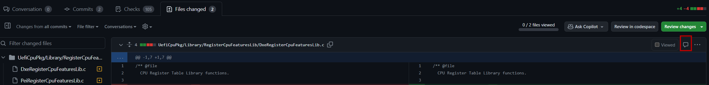
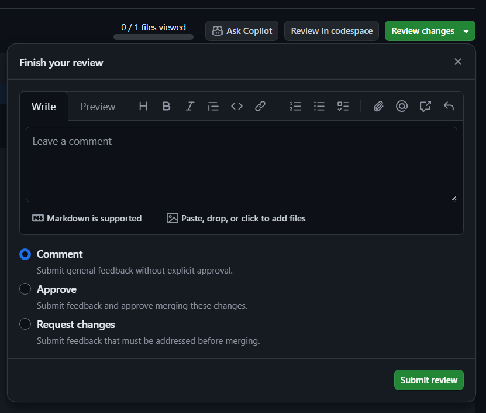

# EDK II Development Process

First check out [[Getting Started with EDK II]] for downloading the latest EDK II development project with your build
environment.

Are you new to using git? If so, then the [[New to git]] page may be helpful.

> **Note:** Commands that you should directly type into a terminal are preceded with `>$`. Unless otherwise noted,
> these commands are OS agnostic.

If you are new to GitHub or looking for ways to make you GitHub workflow more efficient, please read
[GitHub & PR Tips](GitHub-PR-Tips.md "wikilink").

## EDK II Developer Onboarding

At a high-level, getting started with code development in the EDK II repo consists of the following activities:

1. Tool Setup - Performed once per development machine.
2. Workspace Setup - Performed once per development workspace.
3. Development and Test - Performed on every code contribution.
4. Code Review and CI - Performed on every code contribution.

## Tool Setup, Workspace Setup, and Development and Test

Refer to the [Build Instructions](Build-Instructions.md "wikilink") documentation. After following those
instructions, you should have a workspace setup and understand how to build and test the code.

This remainder of this page focuses source management details and how to prepare for code review.

## Contributor Process

1. Create and checkout a topic branch for your change.

   `>$ git checkout -b <new-dev-branch> origin/master`

2. Make changes in the working tree.

3. Break up working tree changes into independent commits that do not break *git bisect*.
   - [Commit-Partitioning](Commit-Partitioning "wikilink")

   - To stage all modifications: `>$ git add -u`
   - To add new files: `>$ git add <path-to-new-file>`
   - To have git prompt you to selectively stage changes: `>$ git add -p`

4. Follow the commit message template given below when writing commit messages.

    - [Commit-Message-Format](Commit-Message-Format "wikilink")

    - To commit staged changes: `>$ git commit`

      - Tip: Add the `-s` parameter to automatically append your `Signed-off-by` tag to the commit message.

    - Note any [TianoCore Bugzilla](https://bugzilla.tianocore.org/) items in the commit message.

5. Use the `PatchCheck.py` script under `edk2/BaseTools/Scripts` directory to verify the commits are correctly
   formatted.

    - To check the latest `<N>` changes: `>$ python BaseTools/Scripts/PatchCheck.py -<N>`

      - For example, 2 changes would be: `>$ python BaseTools/Scripts/PatchCheck.py -2`

    - It is strongly recommended that you run `PatchCheck.py` after each commit. You can then easily amend the commit
      to correct any issues.

6. Get the latest changes from the remote (`origin`).

    `>$ git fetch origin`

    > Note: This updates `origin/master`, but not your local `master` branch. (`origin/master` may have newer commits
    > than `master`).

7. Rebase the topic branch onto `master` branch.

    `>$ git rebase origin/master`

8. Run the automated code formatting tool (Uncrustify) against your changes.

   - [EDK-II-Code-Formatting](EDK-II-Code-Formatting "wikilink")

   - The changes must pass local CI which includes a code formatting check in order to be merged into the code base.

   - It is strongly recommended that you format the code after each commit. The code can then be easily amended with
     the formatted output. Some developers might also prefer to format frequently while writing the code using the
     plugin instructions described in the code formatting wiki page.

9. Compile and run local CI checks.

   - [Build Instructions](Build-Instructions.md "wikilink")

   - If you encounter a CI failure, you can use Stuart to run CI checks locally.

     - [How to Build with Stuart](How-to-Build-With-Stuart.md "wikilink")

     - Stuart can both compile your code and run CI plugins that check other aspects of the code outside compilation.

     - These are the same CI checks that will run against the code when you create a pull request. By running the tests
       locally you will be able to get results much more quickly and reduce overhead on CI resources.

     - However, some aspects of what is used in CI versus your local setup might be different depending on what
       parameters you pass to Stuart. For example, if CI is using VS2019 and you are using VS2017, you might get
       different compilation results.

     - If you are new to the Stuart build system, first learn about the basics of Stuart in the link above and then
       read the "I just want to check if my changes will pass all the non-compiler checks in CI" section to learn how
       to get CI results without having to wait through compilation.

10. Push changes to the developer's fork of the EDK II project repository.

    - How to create a [GitHub fork](https://help.github.com/en/github/getting-started-with-github/fork-a-repo)
      - **NOTE:** A GitHub fork can also be created using the command line utility called [`gh`](https://cli.github.com/).
        - See [`gh repo fork`](https://cli.github.com/manual/gh_repo_fork).

    - Add remote to the developer's fork of the EDK II project.

      - `>$ git remote add <developer-id> https://github.com/<developer-id>/edk2.git`

    - Push the integration branch.

      - `>$ git push <developer-id> <new-integration-branch>`

11. Create a GitHub pull request from the developer's `<new-integration-branch>` to `edk2/master`.

    - How to create a [GitHub pull request](https://help.github.com/en/github/collaborating-with-issues-and-pull-requests/creating-a-pull-request).

      - **NOTE:** A GitHub pull request can also be created using the command line utility called [`gh`](https://cli.github.com/).
        - See [`gh pr`](https://cli.github.com/manual/gh_pr).

    - Add the relevant reviewers and maintainers as reviewers to the pull request.
      - You can find the reiewers and maintains for the code areas touched by your changes in
        [Maintainers.txt](https://github.com/tianocore/edk2/blob/master/Maintainers.txt).

      - You can also use the [GetMaintainer.py](https://github.com/tianocore/edk2/blob/master/BaseTools/Scripts/GetMaintainer.py)
        script to find the list of reviewers to add.

    - Resolve GitHub pull request issues if failures are reported. Common failures are shown below.

      - A merge conflict is detected. You may attempt to resolve the merge conflicts outside of GitHub by rebasing
        `<new-integration-branch>` with `edk2/master` and resolving any conflicts that need manual resolution. After
        amending the relevant commits with the changes needed, a force push to `<new-integration-branch>` automatically
        restarts the checks.

      - The pull request fails the `PatchCheck.py` check. Resolve the issues reported by `PatchCheck.py`. A force push
        to `<new-integration-branch>` can be used to automatically restart the checks.

      - The pull request fails Windows or Ubuntu checks. The GitHub pull request provides links to the Azure Pipelines
        results that are used to view test results for checks that failed.

    - If you are unsure how to resolve a PR failure, leave a comment in the PR to ask for help.

12. Modify local commits based on the review feedbacks and repeat steps 2 to 10.

    - For the latest commit, you can use `>$ git commit --amend`

    - For multiple commits use `>$ git rebase -i origin/master`

    - Create a [GitHub discussion](https://github.com/tianocore/edk2/discussions) or consult your git gurus on
      edk2-devel or irc channel if you have git questions.

    - Follow the [PR Conversation Resolution Process](#pr-conversation-resolution-process) to resolve feedback
      conversations.

13. Update [TianoCore Bugzilla](https://bugzilla.tianocore.org/) issue(s) resolved by the change(s).

    - Add a pointer to the GitHub pull request (e.g. [Readme.md: Update EDK II CI build branch name](https://github.com/tianocore/edk2/pull/153)).

    - Add the PR merged to `edk2/master` (e.g. `Completed in PR https://github.com/tianocore/edk2/pull/153`).

    - Mark BZ issues as Resolved/Fixed.

## Maintainer Process

1. It is recommended to register for email notifications for pull requests, pushes, and check status results by
   setting up notifications for the EDK II repository ([tianocore/edk2](https://github.com/tianocore/edk2)).

   - [Configuring notifications](https://docs.github.com/en/account-and-profile/managing-subscriptions-and-notifications-on-github/setting-up-notifications/configuring-notifications)

2. Verify that the Pull Request title and description succinctly describe the changes.

   - PR titles and descriptions are used in repo searches and show up in release notes. More precise titles make
     finding changes easier in the future. High quality descriptions make it much easier to understand a set of changes
     in the PR.

3. Verify that the proper set of reviewers are on the pull request. Add any reviewers that are missing.

4. Verify that the commit(s) can individually be submitted to `edk2/master`. Squashing commits is not allowed.

   - [Commit-Message-Format](Commit-Message-Format "wikilink")

5. Review the files relevant to you. Once all files are reviewed and any feedback you left is addressed, mark the PR
   as approved.

   - If you are leaving general feedback (not on a line of code) and you would like to ensure that your feedback is
     acknowledged and resolved, use a file comment by clicking the button shown below.

     

     - Unlike a generic comment left in the PR, a comment in a code file must be resolved before the PR can be
       completed.

   - If you would like to leave a comment on a specific commit, it is recommended to leave a comment on the file
     and simply reference the commit in the comment. For example, "this change should be in commit `<commit A title>`
     instead of commit `<commit B title>`".

   - Ensure conversations in the PR follow the [PR Conversation Resolution Process](#pr-conversation-resolution-process).

   - Note: An approval means you approve of all the changes applicable to you in the PR.

   - Apart from generic comments left in the PR and the comments left on specific files mentioned above, you can also
     leave a comment at the time you "Approve" or "Request changes". In the GitHub Web UI, click the "Files changed"
     tab and then "Review changes", select the appropriate radio box, leave your comment, and then click
     "Submit review".

     

6. Each code area modified in the PR will have a list of reviewers and maintainers assigned to the path in
   [Maintainers.txt](https://github.com/tianocore/edk2/blob/master/Maintainers.txt). If at least one reviewer assigned
   to each code area has approved the PR, the `"push"` label may be added to complete the PR.

   - Note: All PR status checks must succeed and there must be no merge conflicts for the PR to complete.

### PR Conversation Resolution Process

All conversations must be resolved for a PR to be completed. This is the process used to resolve conversations.

1. A PR author is allowed to resolve conversations after they have addressed feedback.
2. After addressing feedback, a PR author is expected to leave a comment describing their resolution in the
   conversations.
3. A conversation cannot be resolved until the PR author and commenter have reached an agreed upon resolution.

## Maintainer Process for the EDK II BaseTools Project

[EDK II BaseTools project](https://github.com/tianocore/edk2-basetools) is a Tianocore-maintained project consisting
of the python source files that make up EDK2 basetools. It provides an easy way to organize and share python code to
facilitate reuse across environments, tools, and scripts. In the future, this project will be the only location of the
EDK II BaseTools python source code, and the EDK II project will remove all BaseTools python source code.

Now, we are in the phase where the BaseTools python code is in both the [edk2](https://github.com/tianocore/edk2)
repository and the [edk2-basetools](https://github.com/tianocore/edk2-basetools) repository. The BaseTools maintainer
should follow the following steps to keep the code in sync.

1. After the patch gets reviewed, the maintainer creates a PR to the `edk-basetools` repo, and merges it into the
   `edk2-basetools` repo if the CI checks pass.
2. Wait for the new version pip module generated in pypi.org.
3. Update the `edk2-basetools` value to the latest basetools pip module version from the `edk2/pip-requirements.txt`
   file. Create a PR to the edk2 repo to trigger edk2 CI to do the packages build tests.
4. Create a pip-requirement patch and send it to community review.
5. Get the Reviewed-by from the reviewers.
6. Create a PR and merge the pip-requirement change to edk2 repository.
7. Create a PR and merge the basetools patch to edk2 repository.

## See Also

- [[Commit-Message-Format]]
- [[Code-Style]]
- [[Inclusive Language Guidelines]]
