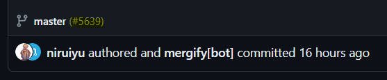
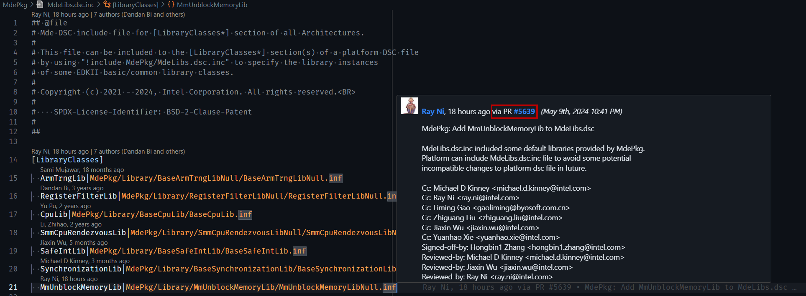

# GitHub & Pull Request (PR) Tips

As of May 2024, the TianoCore project transitioned from a mailing list based contribution process to a pull request
process. Since many community developers may not be familiar with essential GitHub and pull request features, this guide
is meant to show various tips to improve your workflow making it easier to contribute and review changes in edk2.

1. [GitHub UI key features](#github-ui-key-features)
   - [Forking the edk2 repository](#forking-the-edk2-repository)
   - [Setting up notifications for the edk2 repository](#setting-up-notifications-for-the-edk2-repository)
   - [Creating a Pull Request](#creating-a-pull-request)
   - [Viewing Changes in a Pull Request](#viewing-changes-in-a-pull-request)
   - [Leaving Feedback in a Pull Request](#leaving-feedback-in-a-pull-request)
   - [Viewing Open & Closed Pull Requests](#viewing-open--closed-pull-requests)
   - [Finding a commit](#finding-a-commit)
   - [Finding a Pull Request for a commit](#finding-a-pull-request-for-a-commit)
   - [Contributing entirely in your Web browser](#contributing-entirely-in-your-web-browser)

2. [VS Code GitHub PR plugin](#2-vs-code-github-pr-plugin)

3. [Official GitHub CLI tool](#3-official-github-cli-tool)

4. [Official GitHub Desktop application](#4-official-github-desktop-application)

## GitHub UI Key Features

### Forking the edk2 Repository

Forking a repository on GitHub creates a copy of the original repository under your GitHub account, allowing you to
freely experiment with changes without affecting the original project. **You must create a fork** of the edk2
repository to create a pull request. To fork the edk2 repository:

1. Navigate to the edk2 repository on GitHub.
2. Click on the "Fork" button in the upper-right corner of the repository page.
3. Select your GitHub username where you want to fork the repository.

- See [Fork a Repo](https://docs.github.com/pull-requests/collaborating-with-pull-requests/working-with-forks/fork-a-repo) for more information.

Once your fork is setup, you can push a branch to the fork with your changes and then create a pull request into the
tianocore/edk2 repo from the branch on the fork.

### Setting Up Notifications for the edk2 Repository

Notifications help you stay informed about certain activities in the repository. Review the following links to better
understand the types of notifications available and how to set them up:

- [About Notifications](https://docs.github.com/account-and-profile/managing-subscriptions-and-notifications-on-github/setting-up-notifications/about-notifications)
- [Configuring Notifications](https://docs.github.com/account-and-profile/managing-subscriptions-and-notifications-on-github/setting-up-notifications/configuring-notifications)

### Creating a Pull Request

Creating a pull request is the primary way to contribute changes to a repository on GitHub. There are many ways to
create a pull request depending on whether you are using the GitHub Web UI or a tool like GitHub Desktop, VS Code,
the GitHub CLI, or another tool.

The quickest approach when using the GitHub Web UI is to push the branch to your forked repository and then visit the
[tianocore/edk2](https://github.com/tianocore/edk2) repo. The UI will conveniently display an option to create a pull
request from the branch you just pushed to your fork.

- See [Creating a Pull Request](https://docs.github.com//pull-requests/collaborating-with-pull-requests/proposing-changes-to-your-work-with-pull-requests/creating-a-pull-request) for more information.

### Viewing Changes in a Pull Request

Pull request reviews can also happen in a number of different tools. When first getting started, try out a few options
and see what works best for you. Many users start with the GitHub Web UI but find that it is not as feature-rich as
other options.

For example, I prefer to review code within the context of the full codebase so surrounding code is readily displayed
and I can easily search across the codebase while reviewing. This is why I tend to use VS Code with the GitHub PR
extension when reviewing a non-trivial change. I can review code with the same level of IDE support used when writing
code and it is easy to leave comments, code suggestions, and respond to conversations. It also allows code to easily
be checked out locally to test the changes and make any modifications on top.

Suggested reading:

- [About PR reviews](https://docs.github.com/pull-requests/collaborating-with-pull-requests/reviewing-changes-in-pull-requests/about-pull-request-reviews)
- [Reivew proposed changes](https://docs.github.com/pull-requests/collaborating-with-pull-requests/reviewing-changes-in-pull-requests/reviewing-proposed-changes-in-a-pull-request)

### Leaving Feedback in a Pull Request

The edk2 project requires that conversations be resolved before a pull request can be merged. Conversations are
typically resolved by clicking a "Resolve conversation" button. Comments left in a code file whether on a specific
line of code or as a general file comment must be resolved.

If you would like to simply leave a comment without requiring a resolution, you can leave a comment outside of a file
such as in the comment box at the bottom of the pull request.

- [Comment on a PR](https://docs.github.com/pull-requests/collaborating-with-pull-requests/reviewing-changes-in-pull-requests/commenting-on-a-pull-request)

The above link also shows how you can leave a code suggestion for a section of code in a pull request. The following
link shows how the author of a pull request can apply a code suggestion.

- [Incorporate feedback](https://docs.github.com/pull-requests/collaborating-with-pull-requests/reviewing-changes-in-pull-requests/incorporating-feedback-in-your-pull-request
)

### Viewing Open & Closed Pull Requests

There are many ways to view pull requests. The most common view is to navigate to the ["Pull requests" tab](https://github.com/tianocore/edk2/pulls)
of the repository. There you can quickly filter by open/closed status, author, labels, review status, and more. In
addition, the PR status check status is displayed next to each PR.

You can find all of the pull requests and issues you've created and been asked to review across repos specific to your
account by going to the dashboard by clicking the buttons described in [Viewing all of your issues and pull requests](https://docs.github.com/issues/tracking-your-work-with-issues/viewing-all-of-your-issues-and-pull-requests).

### Finding a Commit

To locate a specific commit within the repository's history.

1. Go to the repository on GitHub (e.g., [edk2](https://github.com/tianocore/edk2)).
2. Click on the "`<X> Commits`" button where `<X>` is the number of commits currently in the selected branch.
3. Click the commit.

> Note: If you have a commit hash, for example `4b6ee06a090d956f80b4a92fb9bf03098a372f39`, you can append it to the
> repository URL to view the commit directly. For example, <https://github.com/tianocore/edk2/commit/4b6ee06a090d956f80b4a92fb9bf03098a372f39>.

- [About commits](https://docs.github.com/pull-requests/committing-changes-to-your-project/creating-and-editing-commits/about-commits)
- [Searching commits](https://docs.github.com/search-github/searching-on-github/searching-commits)

### Finding a Pull Request for a Commit

Once you have a commit hash/URL such as <https://github.com/tianocore/edk2/commit/4b6ee06a090d956f80b4a92fb9bf03098a372f39>,
you can quickly find the associated pull request by looking for the pull request link next to the branch name. In the
example below, clicking [`#5639`](https://github.com/tianocore/edk2/pull/5639) will take you to the pull request.



Other tools also provide ways to find the pull request for a commit. For example, it is possible in the GitHub CLI
to use:

```bash
  >$ gh pr list --search "4b6ee06" --state merged
```

In an IDE like VS Code with the recommended extensions installed, you can simply hover over a line of modified code to
see the commit and pull request information for the change:



### Contributing Entirely in Your Web Browser

If you contribute infrequently or want to make a quick change on a system without setting it up for development, you
might be interested in [GitHub Codespaces](https://github.com/features/codespaces). Using Codespaces, you can work
entirely in your Web browser in a feature rich environment that includes a terminal, code editor, and more to submit
your change. GitHub provides a number of free hours per month for Codespaces usage.

The edk2 project provides a [Fedora](https://github.com/tianocore/containers/pkgs/container/containers%2Ffedora-39-test)
and [Ubuntu](https://github.com/tianocore/containers/pkgs/container/containers%2Fubuntu-22-test)
[dev container](https://github.com/tianocore/edk2/blob/master/.devcontainer/devcontainer.json) you can use for your
Codespaces environment.

- [GitHub Codespaces overview](https://docs.github.com/en/codespaces/overview)
- [TianoCore containers](https://github.com/tianocore/containers)

---

A lighter weight and completely free alternative to simply edit files your Web browser is to use the built-in editor
in the GitHub Web UI called the github.dev web-based editor. This allows you to edit files in your browser, create
branches, and PRs without having to clone anything locally. This might be useful if you are making very light changes
such as editing text files or updating Python dependencies and your changes can entirely be tested in the PR status
checks.

- [The github.dev web-based editor](https://docs.github.com/codespaces/the-githubdev-web-based-editor)

## 2. VS Code GitHub PR Plugin

### Overview

The VS Code GitHub Pull Requests and Issues extension allows seamless integration of GitHub pull requests and issues
directly within the VS Code editor. This provides a powerful interface for reviewing and managing pull requests without
leaving your development environment.

- [GitHub Pull Requests and Issues](https://marketplace.visualstudio.com/items?itemName=GitHub.vscode-pull-request-github)

Review's the [extension's documentation](https://github.com/Microsoft/vscode-pull-request-github#readme) to learn how
to use it effectively.

It is recommended to install these extensions as well to make the most of git and GitHub integration in VS Code:

- [Dev Containers](https://marketplace.visualstudio.com/items?itemName=ms-vscode-remote.remote-containers)
- [GitLens](https://marketplace.visualstudio.com/items?itemName=eamodio.gitlens)
- [Git History](https://marketplace.visualstudio.com/items?itemName=donjayamanne.githistory)

## 3. Official GitHub CLI Tool

[GitHub CLI (gh)](https://cli.github.com/) is the official command-line tool for interacting with GitHub repositories
and pull requests. With GitHub CLI, you can interact with GitHub directly from the terminal. It is open-source and
available for Linux, macOS, and Windows.

- [Installation Instructions](https://github.com/cli/cli#installation)
- [GitHub CLI Manual](https://cli.github.com/manual/)

## 4. Official GitHub Desktop Application

[GitHub Desktop](https://desktop.github.com/) is a user-friendly application for managing GitHub repositories on your
desktop. If you find the command-line interface intimidating and would prefer not to use VS Code with extensions, the
GitHub Desktop application is a great alternative.

It provides an intuitive interface for performing common Git operations, including creating branches, committing
changes, and managing pull requests. If you are new to git, you might also find the GitHub desktop documentation
helpful for getting started.

- [GitHub Desktop documentation](https://docs.github.com/en/desktop)
