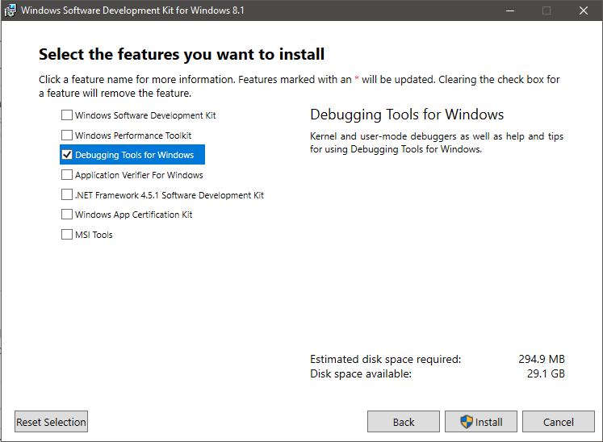
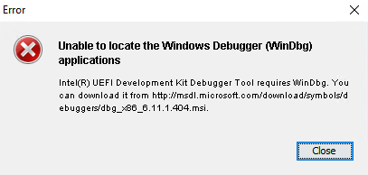
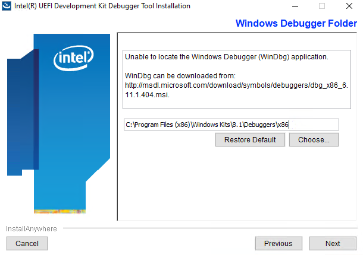
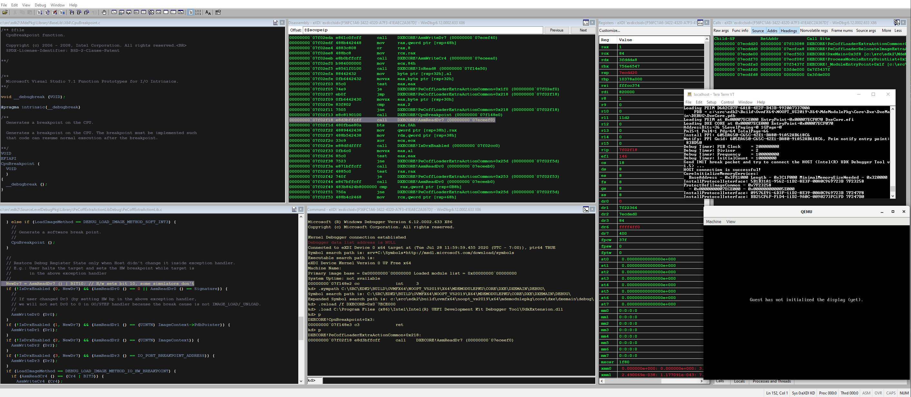
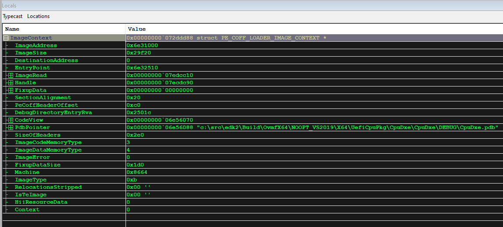
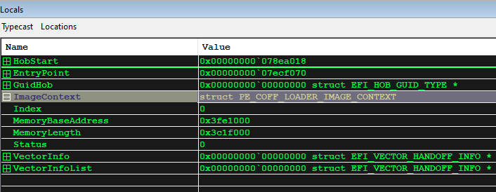

# Debugging EDK II using OvmfPkg with QEMU and the Windows Debugger (WinDbg)
This example shows how to enable source debugging in QEMU with OvmfPkg using WinDbg.

## Download the Required Applications
These instructions were tested on a Windows 10 host (19042) with QEMU 4.2.0, WinDbg from the Windows 8.1 SDK (6.3.9600.17298),
and the Intel UDK Debugger Tool v1.5 for Windows.

### WinDbg
* This version of the SDK can be downloaded from the [SDK archive](https://developer.microsoft.com/en-us/windows/downloads/sdk-archive/)
  or via [this direct link](https://go.microsoft.com/fwlink/p/?LinkId=323507).
  * For the purposes of source debugging, only the "Debugging Tools for Windows" needs to be selected during installation.

  

  * These instructions will use the default installation location for WinDbg: \
    `C:\Program Files (x86)\Windows Kits\8.1\Debuggers\x86`
    * If you chose a different installation location, note it for future steps.

### Intel UDK Debugger Tool
* Download the installer from [Intel Software](https://software.intel.com/content/www/us/en/develop/articles/unified-extensible-firmware-interface.html)
  or via [this direct link](https://software.intel.com/sites/default/files/managed/de/00/UDK_Debugger_Tool_v1_5_Win.zip)
* Begin installation
  * The default installation location will be used for the remaining instructions: \
    `C:\Program Files (x86)\Intel\Intel(R) UEFI Development Kit Debugger Tool`

  * The installer will likely complain it cannot find a WinDbg installation as it looks in an older location.

  

  * Provide the WinDbg location used during its installation.

  

  * The installer will ask how you plan to debug. You can change this later but we can provide the settings we will use now.
    * **Debug Port Channel**: TCP
    * **Server**: localhost
    * **Port**: 20716 _(any available port can be used)_

  * Once installation is complete, you can tweak your Intel UDK configuration file further from this location: \
    `C:\Program Files (x86)\Intel\Intel(R) UEFI Development Kit Debugger Tool\SoftDebugger.ini`

  * For reference, by default it should contain the following contents:
```
   [Debug Port]
   Channel = TCP
   Port = 20716
   FlowControl = 1
   BaudRate = 115200
   Server = localhost

   [Target System]
   ; Debugger needs to know the target processor count in the initialization step.
   ;  Use a value larger enough.
   ProcessorCount = 16
   FlashRange        = 0xFF000000:0x1000000
   ;TemporaryRamRange = 0x80000000:0x80000
   NoAccessLimit     = 0x80000000

   [Debugger]
   Executable = C:\Program Files (x86)\Windows Kits\8.1\Debuggers\x86\windbg.exe
   Directory = C:\Program Files (x86)\Windows Kits\8.1\Debuggers\x86

   [Features]
   ; Have WinDbg to load the module symbols when the module is loaded in target,
   ;  which enables to set unresolved breakpoints.
   LoadModuleSymbol = 1

   TerminalRedirectionPort = 20715
```

  * You can customize this file further to suit your situation. The flash range for OVMF can be found in
    [OvmfPkg/OvmfPkgDefines.fdf.inc](https://github.com/tianocore/edk2/blob/master/OvmfPkg/OvmfPkgDefines.fdf.inc).
    * For example, for a 4MB image the flash range is currently defined as: \
      [0xFFC00000 : 0xFFFFFFFF]

  * `LoadModuleSymbol` is an important setting to automatically have WinDbg load source symbols and to set unresolved
    breakpoints. Though it does appear to slow the session down when enabled.

  * `NoAccessLimit` can be set to 0.

  * _Note_: `BaudRate` and `FlowControl` settings are used for serial channels and not required at this time
    though they are not harmful to leave in the file.

### Building the Firmware
The firmware should be built with the `SOURCE_DEBUG_ENABLE` option set to `TRUE` and `DEBUG_ON_SERIAL_PORT` defined. This
example builds a 64-bit OVMF image with Visual Studio 2019.

`build -p OvmfPkg/OvmfPkgX64.dsc -a X64 -t VS2019 -D SOURCE_DEBUG_ENABLE=TRUE -D DEBUG_ON_SERIAL_PORT`

If you'd like to disable optimizations, you can specify a NOOPT build target. For example:

`build -p OvmfPkg/OvmfPkgX64.dsc -a X64 -t VS2019 -b NOOPT -D SOURCE_DEBUG_ENABLE=TRUE -D DEBUG_ON_SERIAL_PORT`


### Launching the Debug Session
You can launch QEMU and quickly run the "Start WinDbg with Intel UDK Debugger Tool" shortcut in the Start menu. However,
the timing can be sensitive during initialization and you might get a connection timeout. It is recommended to launch
the appropriate applications from a batch file to start the session reliably.

Here's a sample batch file that redirects the monitor and serial output to PuTTY:

```
start "Monitor" /B "C:\PuTTY\PUTTY.EXE" telnet://localhost:20717
start "Debugger" /B "C:\Program Files (x86)\Intel\Intel(R) UEFI Development Kit Debugger Tool\eXdi.exe" /LaunchWinDbg
start "Console" /B "C:\PuTTY\PUTTY.EXE" telnet://localhost:20715

start "QEMU" /B "C:\Program Files\qemu\qemu-system-x86_64.exe" ^
  -machine q35,smm=on ^
  -global ICH9-LPC.disable_s3=1 ^
  -drive if=pflash,format=raw,unit=0,file=C:\src\edk2\Build\OvmfX64\DEBUG_VS2019\FV\OVMF_CODE.fd,readonly=on ^
  -drive if=pflash,format=raw,unit=1,file=C:\src\edk2\Build\OvmfX64\DEBUG_VS2019\FV\OVMF_VARS.fd ^
  -monitor tcp:localhost:20717,server ^
  -serial tcp:localhost:20716,server
```

Similar example that uses Tera Term:

```
start "Monitor" /B "c:\Program Files (x86)\teraterm\ttermpro.exe" localhost:20717 /nossh
start "Debugger" /B "C:\Program Files (x86)\Intel\Intel(R) UEFI Development Kit Debugger Tool\eXdi.exe" /LaunchWinDbg
start "Console" /B "c:\Program Files (x86)\teraterm\ttermpro.exe" localhost:20715 /nossh

start "QEMU" /B "C:\Program Files\qemu\qemu-system-x86_64.exe" ^
  -machine q35,smm=on ^
  -global ICH9-LPC.disable_s3=1 ^
  -drive if=pflash,format=raw,unit=0,file=C:\src\edk2\Build\OvmfX64\DEBUG_VS2019\FV\OVMF_CODE.fd,readonly=on ^
  -drive if=pflash,format=raw,unit=1,file=C:\src\edk2\Build\OvmfX64\DEBUG_VS2019\FV\OVMF_VARS.fd ^
  -monitor tcp:localhost:20717,server ^
  -serial tcp:localhost:20716,server
```

Note that other customizations are possible for QEMU configuration this is just demonstrating an instance of
configuration settings.

### WinDbg Working Case Examples
This section briefly shows some samples of expected behavior when source level debug is working.

Multiple panels can be used to view system registers, the call stack, disassembly, source code, and the debugger
command panel:



Locals can be viewed:



Types of locals are generally handled well:



### More Information
There are many resources available online to help get started with using the Windows Debugger. These are just some
starting points:

1. Intel UDK Debugger Tool Configuration and Setup Guide (a PDF in your installation directory).

   This document also explains how to use some helpful Python extensions in WinDbg that can do things like
   dump the MTRR settings and perform firmware-specific operations such as dumping UEFI variables and the HOB list.

2. [MSDN Debugger Resources](https://docs.microsoft.com/en-us/windows-hardware/drivers/debugger/debugging-resources)
3. [MSDN Debugging Using WinDbg](https://docs.microsoft.com/en-us/windows-hardware/drivers/debugger/debugging-using-windbg)
