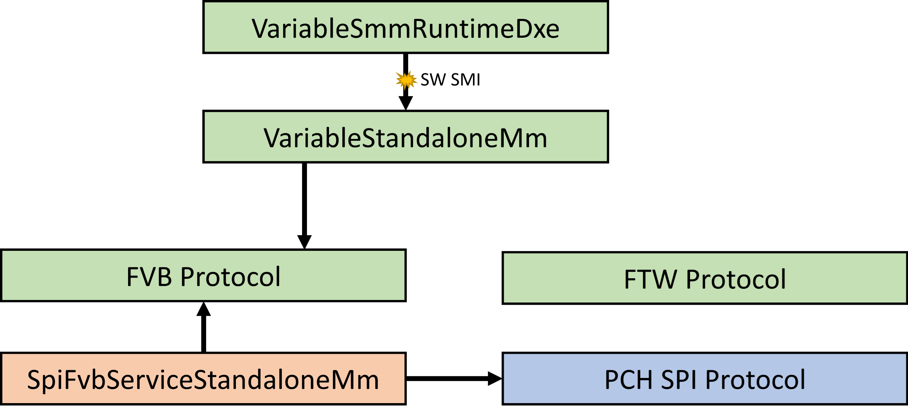
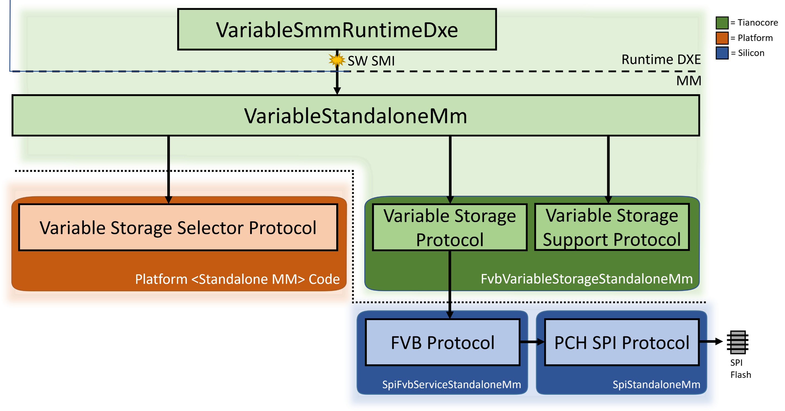

# UEFI Variable Router

The UEFI Specification describes an interface between the operating system (OS) and platform firmware. A UEFI
Specification compliant system must implement two high-level sets of services – Boot Services which consist of functions
available prior to a successful call to `EFI_BOOT_SERVICES.ExitBootServices()` and Runtime Services which consist of
functions that are available before and after any call to `EFI_BOOT_SERVICES.ExitBootServices()`.

A fundamental Runtime Service is called the UEFI variable services. These services are comprised of an API that the
platform firmware must implement to satisfy the relevant API requirements defined in the UEFI Specification. While the
underlying implementation is platform-specific, the callers will include both the operating system and firmware
components.

## Problem Statement

The de facto open-source implementation of UEFI, [TianoCore](https://www.tianocore.org/), provides a commonly used
set of [UEFI variable drivers](https://github.com/tianocore/edk2/tree/master/MdeModulePkg/Universal/Variable) in the
[EDK II](https://github.com/tianocore/edk2) project that has served as the industry standard implementation for UEFI
variable services for over a decade. Over time, the UEFI variable driver has substantially grown in complexity to
support an increasing number of features.

The following key problems are present in the EDK II UEFI variable driver today:

1. Hardcoded for NOR-based non-volatile storage media

    The current driver assumes the storage media used to retain non-volatile UEFI variable data will be memory
    addressable technology such as SPI NOR flash. While historically, this was a relatively safe assumption (especially
    for UEFI firmware-based systems), an increasing number of modern system designs are based on high-density (and
    therefore high capacity) NAND technologies such as eMMC, NVMe, and UFS. While eMMC and UFS are traditionally more
    common in ultra-mobile devices such as phones and tablets, NVMe has become a popular choice as the primary storage
    device in systems ranging from laptops to servers.

    An advantage that these new classes of storage technologies provide are hardware partitions (customizable during
    provisioning) with unique properties. For example, eMMC provides two boot partitions that offer simplified software
    access that caters to early firmware involved in early system bring up. A Replay-Protected Memory Block (RPMB)
    partition provides replay-protected storage which is a notable hardware capability not present in most SPI flash
    devices (some SPI flash devices do have a Replay Protection Monotonic Counter (RPMC) which can be used to build
    similar protection). Another hardware partition called the User Data Area is used for the actual operating system
    storage; it might be organized into software partitions such as those in a GUID Partition Table (GPT) layout. On a
    device such as eMMC, UEFI variable data would likely be stored in the RPMB to take advantage of its built-in
    security properties. Since NAND media can support both firmware storage and user data storage on a single device,
    manufacturers frequently consider saving on system BOM cost by eliminating a SPI flash device with a single
    NAND-based flash device.

    A key difference in the memory architecture between NAND and NOR flash memories is how memory cell organization
    contributes to memory addressing. NOR flash provides enough address lines to map the entire memory range per cell
    which results in fast reads (but slow write and erase cycles) and support for random access using MMIO. This is
    ideal for code execution and leads to SPI flash being a common non-volatile storage medium for device firmware and
    UEFI variable storage. NAND flash does not allow random access. Instead, an indirect I/O interface is used which
    requires a software driver to shadow memory contents to system DRAM. This fundamental difference with NOR storage
    significantly changes the assumptions built around storage availability during various periods of system operation
    and the software stack necessary to support UEFI variable storage.

    In addition to new storage technologies, overall system design has matured since the original UEFI variable driver
    was implemented. Authenticated UEFI variables require an isolated execution environment. In x86 architecture, the
    only ubiquitous environment that meets this requirement is System Management Mode (SMM). However, SMM has major
    drawbacks that have led to industry-wide efforts to reduce its overall footprint. For variable services, a common
    trend has been to offload UEFI variable implementation to a separate service processor such as a security processor
    or Baseboard Management Controller (BMC).

    In summary, whether to reduce BOM cost by leveraging new storage technologies or to add flexibility in UEFI variable
    storage implementation, the hardcoded implementation in the core UEFI variable driver is problematic. This leads to
    forked copies of the driver that diverge significantly from the upstream resulting in increased likelihood of bugs
    and a high cost of software maintenance.

2. Single instance variable store assumption

    Traditional UEFI firmware implementations have a single UEFI variable store. However, it is desirable to have the
    flexibility for N instances of UEFI variable stores in a platform:

    - To route specific UEFI variables to a UEFI variable store with specific properties
      - For example, to route “large” UEFI variables to a compressed UEFI variable store
        - Usage might need to be limited to reduce performance overhead related to compression
      - For example, to route “sensitive” UEFI variables to an encrypted UEFI variable store
        - Usage might need to be limited to reduce storage overhead related to block cipher size or performance overhead
          related to encryption
      - For example, to route “sensitive” UEFI variables to a replay-protected variable store
        - Usage might need to be limited to reduce operations associated with computing an HMAC signature against the
          variable store contents
    - To route UEFI variables to different backends
      - For example, to route some UEFI variables to local NVMe storage and others to a service processor
      - For example, variables frequently accessed might go to NVMe to reduce access time while others go elsewhere
      - For example, if a given UEFI variable store is exhausted, variables are routed to an alternative store

3. Monolithic implementation that impacts maintainability

  The variable driver does not currently abstract UEFI variable storage from responsibilities needed for the high-level
  interface defined in the UEFI Specification. This is an unnecessary coupling that requires alternative designs to
  manually modify the driver which leads to varying levels of design complexity that impact ability to debug and
  maintainability.

## UEFI Specification Variable Services APIs

The UEFI Specification defined UEFI variable interface consists of several APIs exposed in the Runtime Services table.
These APIs are well-defined and **WILL NOT** be modified in any way by the changes in this proposal.

```c
EFI_STATUS
GetVariable (
  IN  CHAR16    *VariableName,
  IN  EFI_GUID  *VendorGuid,
  OUT UINT32    *Attributes OPTIONAL,
  IN  OUT UINTN *DataSize,
  OUT VOID      *Data OPTIONAL
  );
```

```c
EFI_STATUS
GetNextVariableName (
  IN OUT UINTN    *VariableNameSize,
  IN OUT CHAR16   *VariableName,
  IN OUT EFI_GUID *VendorGuid
  );
```

```c
EFI_STATUS
SetVariable (
  IN CHAR16   *VariableName,
  IN EFI_GUID *VendorGuid,
  IN UINT32   Attributes,
  IN UINTN    DataSize,
  IN VOID     *Data
  );
```

## Current Design

The current UEFI variable driver is a monolithic driver that shares phase-agnostic code in common source files that are
built alongside phase-specific wrapper code into phase-specific binaries. For example,
*MdeModulePkg/Universal/Variable/RuntimeDxe/Variable.c* contains a large portion of UEFI variable implementation is
built in the following INF files to produce the UEFI variable driver for different phases:

- Runtime DXE – `VariableRuntimeDxe`
  - Phase wrapper code: VariableDxe.inf
- SMM – `VariableSmm`
  - Phase wrapper code: VariableSmm.inf
- Standalone MM – `VariableStandaloneMm`
  - Phase wrapper code: VariableStandaloneMm.inf



The most common model on x86 platforms is to combine the Runtime DXE portion of the UEFI variable driver stack
(VariableSmmRuntimeDxe) with a MM counterpart (VariableSmm or VariableStandaloneMm). The Runtime DXE driver implements
the UEFI Specification defined interface for variables as defined in Runtime Services. After the Runtime DXE portion
performs some basic input validation, it shares variable information with the MM driver via a communication buffer and
triggers a software SMI. The MM driver manages writing the data to SPI flash.

## Objective

Address the following issues in the Problem Statement. Specifically:

1. Enable a path for supporting any synchronous variable backend (i.e. variable storage driver) – The variable driver
   implementation will be split into two pieces (1) business logic and (2) storage management.
   - Business logic: Handle basic data input validation and UEFI interface requirements.
   - Storage management: Manage storage-specific functionality for the non-volatile variable storage media/backend.
     - Note:
       1. Only “synchronous” variable storage drivers will be supported by the work in these changes. Synchronous means
          the caller to the variable driver can expect the variable storage operation to complete within a blocking call
          (before the variable storage driver returns from the storage operation request). It is anticipated
          “asynchronous” storage drivers could be supported in the future with backward-compatible interface changes
          made to the interfaces defined in this proposal.
          - Example of synchronous variable storage: SPI flash (MMIO access)
          - Example of asynchronous variable storage: NAND media (driver-based access)
       2. The only “storage management” implementation planned for this work is a FVB variable storage driver. This is
          a direct replacement for the level of storage capability currently supported by the TianoCore UEFI variable
          driver.
2. Enable the platform to individually route variables to an arbitrary number of variable storage drivers.
   - The variable routing logic will be through a dynamic interface (e.g. PPI and protocol) installed by the platform
     supporting flexibility for FV separation of core modules and platform modules.
3. Abstract business logic and storage management implementation to provide the following benefits:
   - Ability to share a single set of audited and open-source input validation logic across diverse platform variable
     designs.
   - Binary separation of responsibilities enabling either instance to be implemented with less overhead (e.g. write
     the business logic in Rust).

## Proposal

### New Protocols

The new protocols introduce a binary interface between the UEFI variable driver and platform routing logic and the UEFI
variable driver and variable storage drivers.

| **Protocol**                           | **Purpose**                                                                              | **Producer**                         | **Consumer**                         | **Allowed Instances** |
| -------------------------------------- | ---------------------------------------------------------------------------------------- |------------------------------------- | ------------------------------------ | --------------------- |
| `VARIABLE_STORAGE_SELECTOR_PROTOCOL`   | Acquire the variable storage instance ID (GUID) for a particular variable name and GUID. | Platform code.                       | The UEFI variable driver.            | 1                     |
| `VARIABLE_STORAGE_PROTOCOL`            | Abstract access details of a non-volatile store.                                         | A variable storage driver instance.  | The UEFI variable driver.            | *N*                   |
| `VARIABLE_STORAGE_SUPPORT_PROTOCOL`    | Provide support services needed to interact with a particular non-volatile var store.    | The UEFI variable driver.            | A variable storage driver instance.  | 1                     |

An arbitrary number of variable storage protocols can be installed until the `VARIABLE_STORAGE_SELECTOR_PROTOCOL` is
installed by the platform. Installation of the `VARIABLE_STORAGE_SELECTOR_PROTOCOL` indicates all variable storage
drivers for this platform are installed and the installed `VARIABLE_STORAGE_SELECTOR_PROTOCOL` instances are able to
begin servicing `GetVariable()` requests. As a result, `EFI_VARIABLE_ARCH_PROTOCOL` is installed at this point per PI
Specification, which more broadly informs the DXE Foundation that read-only and volatile UEFI variable services are now
available and that the DXE Foundation should update the 32-bit CRC of the UEFI Runtime Services Table accordingly.

As is the case before these changes, any DXE driver that relies upon read-only access or read/write access to volatile
UEFI variables, must have this architectural protocol in its dependency expression.

After every UEFI variable storage driver has called `VARIABLE_STORAGE_PROTOCOL->NotifyWriteServiceReady()`, the UEFI
variable driver will install `EFI_VARIABLE_WRITE_ARCH_PROTOCOL` which, per PI Specification, informs the DXE Foundation
that write services for non-volatile UEFI variables are now available and that the DXE Foundation should update the
32-bit CRC of the UEFI Runtime Services Table accordingly.

As is the case before these changes, any DXE driver that relies upon write access to non-volatile UEFI variables must
have this architectural protocol in its dependency expression.



#### `VARIABLE_STORAGE_PROTOCOL`

This protocol is the primary protocol used to exchange UEFI variable information with a specific implementation of
non-volatile variable storage.

```c
struct _EDKII_VARIABLE_STORAGE_PROTOCOL {
  EDKII_VARIABLE_STORAGE_GET_ID                                 GetId;                              ///< Retrieves a protocol instance-specific GUID
  EDKII_VARIABLE_STORAGE_GET_VARIABLE                           GetVariable;                        ///< Retrieves a variable's data given its name and GUID
  EDKII_VARIABLE_STORAGE_GET_AUTHENTICATED_VARIABLE             GetAuthenticatedVariable;           ///< Retrieves an authenticated variable's data given its name and GUID
  EDKII_VARIABLE_STORAGE_GET_NEXT_VARIABLE_NAME                 GetNextVariableName;                ///< Return the next variable name and GUID
  EDKII_VARIABLE_STORAGE_GET_CAPACITY_AND_USAGE_INFO            GetCapacityAndUsageInfo;            ///< Returns information on storage capacity and usage in the variable store
  EDKII_VARIABLE_STORAGE_GET_AUTHENTICATED_SUPPORT              GetAuthenticatedSupport;            ///< Returns whether this storage area supports authenticated variables
  EDKII_VARIABLE_STORAGE_SET_VARIABLE                           SetVariable;                        ///< Sets a variable's value using its name and GUID.
  EDKII_VARIABLE_STORAGE_GARBAGE_COLLECT                        GarbageCollect;                     ///< Performs variable store garbage collection/reclaim operation.
};
```

`GetId()`

Requirement: The GUID returned by each variable storage protocol instance must be unique.

```c
/**
  Retrieves a protocol instance-specific GUID.

  Returns a unique GUID per VARIABLE_STORAGE_PROTOCOL instance.

  @param[in]       This                   A pointer to this variable storage protocol instance.
  @param[out]      VariableGuid           A pointer to the GUID for this protocol instance.

  @retval          EFI_SUCCESS            The data was returned successfully.
  @retval          EFI_INVALID_PARAMETER  A required parameter is NULL.

**/
typedef
EFI_STATUS
(EFIAPI *EDKII_VARIABLE_STORAGE_GET_ID)(
  IN CONST  EDKII_VARIABLE_STORAGE_PROTOCOL   *This,
  OUT       EFI_GUID                          *InstanceGuid
  );
```

`GetVariable()`

```c
/**
  This service retrieves a variable's value using its name and GUID.

  Read the specified variable from the UEFI variable store. If the Data
  buffer is too small to hold the contents of the variable,
  the error EFI_BUFFER_TOO_SMALL is returned and DataSize is set to the
  required buffer size to obtain the data.

  @param[in]       This                   A pointer to this variable storage protocol instance.
  @param[in]       AtRuntime              TRUE if the platform is in OS Runtime, FALSE if still in Pre-OS stage.
  @param[in]       VariableName           A pointer to a null-terminated string that is the variable's name.
  @param[in]       VariableGuid           A pointer to an EFI_GUID that is the variable's GUID. The combination of
                                          VariableGuid and VariableName must be unique.
  @param[out]      Attributes             If non-NULL, on return, points to the variable's attributes.
  @param[in, out]  DataSize               On entry, points to the size in bytes of the Data buffer.
                                          On return, points to the size of the data returned in Data.
  @param[out]      Data                   Points to the buffer which will hold the returned variable value.

  @retval          EFI_SUCCESS            The variable was read successfully.
  @retval          EFI_NOT_FOUND          The variable could not be found.
  @retval          EFI_BUFFER_TOO_SMALL   The DataSize is too small for the resulting data.
                                          DataSize is updated with the size required for
                                          the specified variable.
  @retval          EFI_INVALID_PARAMETER  VariableName, VariableGuid, DataSize or Data is NULL.
  @retval          EFI_DEVICE_ERROR       The variable could not be retrieved because of a device error.

**/
typedef
EFI_STATUS
(EFIAPI *EDKII_VARIABLE_STORAGE_GET_VARIABLE)(
  IN CONST  EDKII_VARIABLE_STORAGE_PROTOCOL   *This,
  IN        BOOLEAN                           AtRuntime,
  IN CONST  CHAR16                            *VariableName,
  IN CONST  EFI_GUID                          *VariableGuid,
  OUT       UINT32                            *Attributes,
  IN OUT    UINTN                             *DataSize,
  OUT       VOID                              *Data,
  OUT       BOOLEAN                           *CommandInProgress
  );
```

`GetAuthenticatedVariable()`

```c
/**
  This service retrieves an authenticated variable's value using its name and GUID.

  Read the specified authenticated variable from the UEFI variable store. If the Data
  buffer is too small to hold the contents of the variable,
  the error EFI_BUFFER_TOO_SMALL is returned and DataSize is set to the
  required buffer size to obtain the data.

  @param[in]       This                   A pointer to this variable storage protocol instance.
  @param[in]       AtRuntime              TRUE if the platform is in OS Runtime, FALSE if still in Pre-OS stage.
  @param[in]       VariableName           A pointer to a null-terminated string that is the variable's name.
  @param[in]       VariableGuid           A pointer to an EFI_GUID that is the variable's GUID. The combination of
                                          VariableGuid and VariableName must be unique.
  @param[out]      Attributes             If non-NULL, on return, points to the variable's attributes.
  @param[in, out]  DataSize               On entry, points to the size in bytes of the Data buffer.
                                          On return, points to the size of the data returned in Data.
  @param[out]      Data                   Points to the buffer which will hold the returned variable value.
  @param[out]      KeyIndex               Index of associated public key in database.
  @param[out]      MonotonicCount         Associated monotonic count value to protect against replay attack.
  @param[out]      TimeStamp              Associated TimeStamp value to protect against replay attack.

  @retval          EFI_SUCCESS            The variable was read successfully.
  @retval          EFI_NOT_FOUND          The variable could not be found.
  @retval          EFI_BUFFER_TOO_SMALL   The DataSize is too small for the resulting data.
                                          DataSize is updated with the size required for
                                          the specified variable.
  @retval          EFI_INVALID_PARAMETER  VariableName, VariableGuid, DataSize or Data is NULL.
  @retval          EFI_DEVICE_ERROR       The variable could not be retrieved because of a device error.

**/
typedef
EFI_STATUS
(EFIAPI *EDKII_VARIABLE_STORAGE_GET_AUTHENTICATED_VARIABLE)(
  IN CONST  EDKII_VARIABLE_STORAGE_PROTOCOL   *This,
  IN        BOOLEAN                           AtRuntime,
  IN CONST  CHAR16                            *VariableName,
  IN CONST  EFI_GUID                          *VariableGuid,
  OUT       UINT32                            *Attributes,
  IN OUT    UINTN                             *DataSize,
  OUT       VOID                              *Data,
  OUT       UINT32                            *KeyIndex,
  OUT       UINT64                            *MonotonicCount,
  OUT       EFI_TIME                          *TimeStamp,
  OUT       BOOLEAN                           *CommandInProgress
  );
```

`GetNextVariableName()`

```c
/**
  Return the next variable name and GUID.

  This function is called multiple times to retrieve the VariableName
  and VariableGuid of all variables currently available in the system.
  On each call, the previous results are passed into the interface,
  and, on return, the interface returns the data for the next
  interface. When the entire variable list has been returned,
  EFI_NOT_FOUND is returned.

  @param[in]      This                   A pointer to this variable storage protocol instance.
  @param[in, out] VariableNameSize       On entry, points to the size of the buffer pointed to by
                                         VariableName. On return, the size of the variable name buffer.
  @param[in, out] VariableName           On entry, a pointer to a null-terminated string that is the
                                         variable's name. On return, points to the next variable's
                                         null-terminated name string.
  @param[in, out] VariableGuid           On entry, a pointer to an EFI_GUID that is the variable's GUID.
                                         On return, a pointer to the next variable's GUID.
  @param[out]     VariableAttributes     A pointer to the variable attributes.

  @retval         EFI_SUCCESS            The variable was read successfully.
  @retval         EFI_NOT_FOUND          The variable could not be found.
  @retval         EFI_BUFFER_TOO_SMALL   The VariableNameSize is too small for the resulting
                                         data. VariableNameSize is updated with the size
                                         required for the specified variable.
  @retval         EFI_INVALID_PARAMETER  VariableName, VariableGuid or
                                         VariableNameSize is NULL.
  @retval         EFI_DEVICE_ERROR       The variable could not be retrieved because of a device error.

**/
typedef
EFI_STATUS
(EFIAPI *EDKII_VARIABLE_STORAGE_GET_NEXT_VARIABLE_NAME)(
  IN CONST  EDKII_VARIABLE_STORAGE_PROTOCOL   *This,
  IN OUT    UINTN                             *VariableNameSize,
  IN OUT    CHAR16                            *VariableName,
  IN OUT    EFI_GUID                          *VariableGuid,
  OUT       UINT32                            *VariableAttributes
  );
```

`GetCapacityAndUsageInfo().`

```c
/**
  Returns information on the amount of space available in the variable store. If the amount of data that can be written
  depends on if the platform is in Pre-OS stage or OS stage, the AtRuntime parameter should be used to compute usage.

  @param[in]  This                           A pointer to this variable storage protocol instance.
  @param[in]  AtRuntime                      TRUE if the platform is in OS Runtime, FALSE if still in Pre-OS stage.
  @param[out] VariableStoreSize              The total size of the NV storage. Indicates the maximum amount
                                             of data that can be stored in this NV storage area.
  @param[out] CommonVariablesTotalSize       The total combined size of all the common UEFI variables that are
                                             stored in this NV storage area. Excludes variables with the
                                             EFI_VARIABLE_HARDWARE_ERROR_RECORD attribute set.
  @param[out] HwErrVariablesTotalSize        The total combined size of all the UEFI variables that have the
                                             EFI_VARIABLE_HARDWARE_ERROR_RECORD attribute set and which are
                                             stored in this NV storage area. Excludes all other variables.

  @retval     EFI_SUCCESS                    Space information returned successfully.
  @retval     EFI_INVALID_PARAMETER          Any of the given parameters are NULL

**/
typedef
EFI_STATUS
(EFIAPI *EDKII_VARIABLE_STORAGE_GET_CAPACITY_AND_USAGE_INFO)(
  IN CONST    EDKII_VARIABLE_STORAGE_PROTOCOL   *This,
  IN          BOOLEAN                           AtRuntime,
  OUT         UINT32                            *VariableStoreSize,
  OUT         UINT32                            *CommonVariablesTotalSize,
  OUT         UINT32                            *HwErrVariablesTotalSize
  );
```

`GetAuthenticatedSupport`

```c
/**
  Returns whether this NV storage area supports storing authenticated variables or not.

  @param[in]  This                           A pointer to this variable storage protocol instance.
  @param[out] AuthSupported                  TRUE if this NV storage area can store authenticated variables,
                                             FALSE otherwise

  @retval     EFI_SUCCESS                    AuthSupported was set successfully.

**/
typedef
EFI_STATUS
(EFIAPI *EDKII_VARIABLE_STORAGE_GET_AUTHENTICATED_SUPPORT)(
  IN CONST    EDKII_VARIABLE_STORAGE_PROTOCOL   *This,
  OUT         BOOLEAN                           *AuthSupported
  );
```

`SetVariable()`

```c
/**
  This code sets a variable's value using its name and GUID.

  Caution: This function may receive untrusted input.
  This function may be invoked in MM mode, and DataSize and data are external input.
  This function will do basic validation, before parsing the data.
  This function will parse the authentication carefully to avoid security issues, like
  buffer overflow, integer overflow.
  This function will check attribute carefully to avoid authentication bypass.

  @param[in]  This                             A pointer to this variable storage protocol instance.
  @param[in]  AtRuntime                        TRUE if the platform is in OS Runtime, FALSE if still in Pre-OS stage.
  @param[in]  VariableName                     Name of Variable to be found.
  @param[in]  VendorGuid                       Variable vendor GUID.
  @param[in]  Attributes                       Attribute value of the variable found.
  @param[in]  DataSize                         Size of Data found. If size is less than the
                                               data, this value contains the required size.
  @param[in]  Data                             Data pointer.
  @param[in]  KeyIndex                         If writing an authenticated variable, the public key index.
  @param[in]  MonotonicCount                   If writing a monotonic counter authenticated variable, the counter value.
  @param[in]  TimeStamp                        If writing a timestamp authenticated variable, the timestamp value.

  @retval     EFI_INVALID_PARAMETER            Invalid parameter.
  @retval     EFI_SUCCESS                      Set successfully.
  @retval     EFI_OUT_OF_RESOURCES             Resource not enough to set variable.
  @retval     EFI_NOT_FOUND                    Not found.
  @retval     EFI_WRITE_PROTECTED              Variable is read-only.

**/
typedef
EFI_STATUS
(EFIAPI *EDKII_VARIABLE_STORAGE_SET_VARIABLE)(
  IN CONST    EDKII_VARIABLE_STORAGE_PROTOCOL   *This,
  IN          BOOLEAN                           AtRuntime,
  IN          CHAR16                            *VariableName,
  IN          EFI_GUID                          *VendorGuid,
  IN          UINT32                            Attributes,
  IN          UINTN                             DataSize,
  IN          VOID                              *Data,
  IN          UINT32                            KeyIndex       OPTIONAL,
  IN          UINT64                            MonotonicCount OPTIONAL,
  IN          EFI_TIME                          *TimeStamp     OPTIONAL,
  OUT         BOOLEAN                           *CommandInProgress
  );
```

`GarbageCollect()`

```c
/**
  Performs variable store garbage collection/reclaim operations. This will never be called during OS runtime.

  @param[in]  This                             A pointer to this variable storage protocol instance.

  @retval     EFI_SUCCESS                      Garbage collection successful.
  @retval     EFI_INVALID_PARAMETER            Invalid parameter.
  @retval     EFI_OUT_OF_RESOURCES             Insufficient resources to complete garbage collection.
  @retval     EFI_WRITE_PROTECTED              Write services are not yet available.

**/
typedef
EFI_STATUS
(EFIAPI *EDKII_VARIABLE_STORAGE_GARBAGE_COLLECT)(
  IN CONST    EDKII_VARIABLE_STORAGE_PROTOCOL   *This
  );
```

#### `VARIABLE_STORAGE_SELECTOR_PROTOCOL`

This protocol is called by the UEFI variable driver to determine how to route variable requests.

```c
struct _EDKII_VARIABLE_STORAGE_SELECTOR_PROTOCOL {
  EDKII_VARIABLE_STORAGE_SELECTOR_GET_ID    GetId;      ///< Retrieves an instance-specific variable storage ID
};
```

`GetId()`

```c
/**
  Gets the ID (GUID) for the variable storage instance that is used to store a given variable.

  @param[in]  VariableName       A pointer to a null-terminated string that is
                                 the variable's name.
  @param[in]  VariableGuid       A pointer to an EFI_GUID that is the variable's
                                 GUID. The combination of VariableGuid and
                                 VariableName must be unique.
  @param[out] VariableStorageId  The ID for the variable storage instance that
                                 stores a given variable

  @retval     EFI_SUCCESS        Variable storage instance ID that was retrieved
  @retval     Other              An error occurred determining the variable storage instance ID.

**/
typedef
EFI_STATUS
(EFIAPI *EDKII_VARIABLE_STORAGE_SELECTOR_GET_ID)(
  IN  CONST  CHAR16       *VariableName,
  IN  CONST  EFI_GUID     *VendorGuid,
  OUT        EFI_GUID     *VariableStorageId
  );
```

#### `VARIABLE_STORAGE_SUPPORT_PROTOCOL`

This protocol is used to provide auxiliary information needed for variable storage drivers not related to actual
variable operations.

```c
struct _EDKII_VARIABLE_STORAGE_SUPPORT_PROTOCOL {
  EDKII_VARIABLE_STORAGE_SUPPORT_NOTIFY_WRITE_SERVICE_READY     NotifyWriteServiceReady;  ///< Notify that SetVariable() is ready
};
```

`WriteServiceReady()`

```c
/**
  Notifies the core variable driver that the Variable Storage Driver's WriteServiceIsReady() function
  is now returning TRUE instead of FALSE.

  The Variable Storage Driver is required to call this function as quickly as possible.

  @param[out] VariableStorageId  The ID for the variable storage instance represented by this call.

**/
typedef
VOID
(EFIAPI *EDKII_VARIABLE_STORAGE_SUPPORT_NOTIFY_WRITE_SERVICE_READY)(
  IN  CONST  EFI_GUID     *VariableStorageId
  );
```